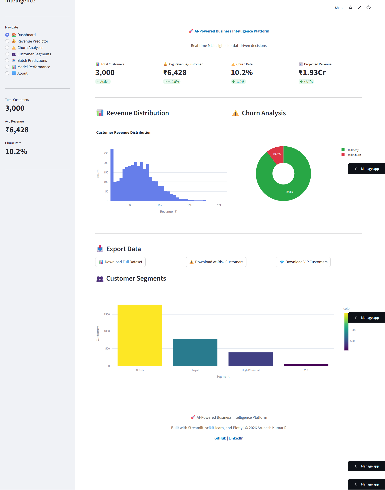
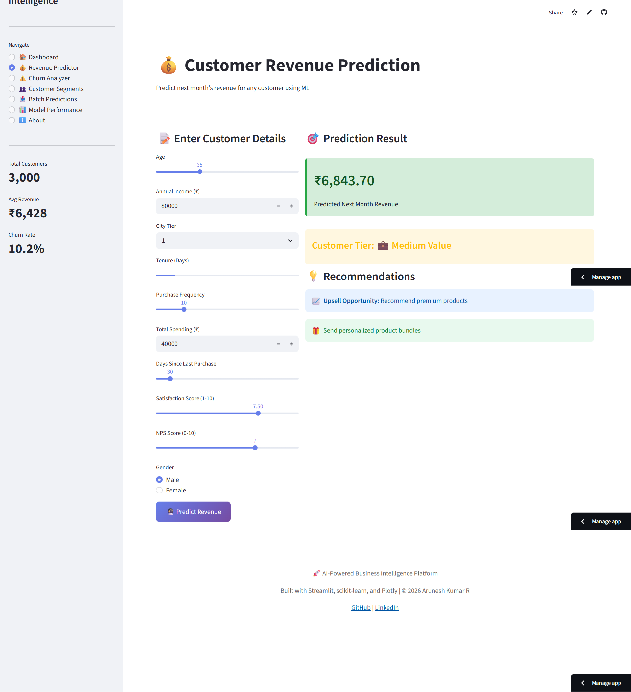
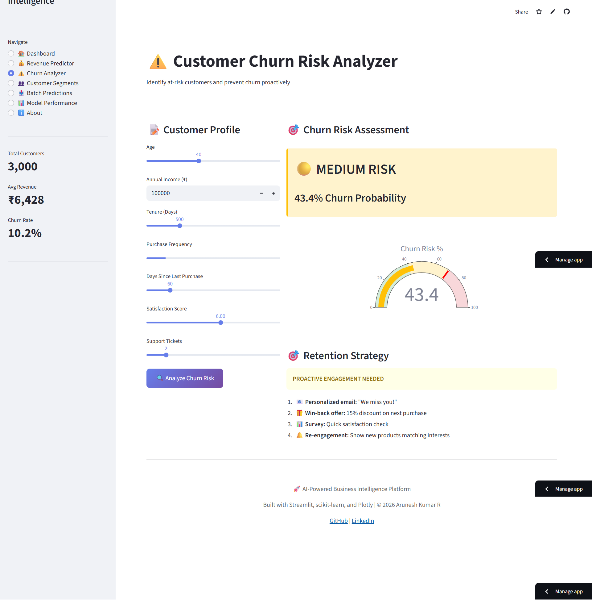

# 🚀 AI-Powered Business Intelligence Platform

> Production-ready ML dashboard combining Revenue Prediction, Churn Prevention, and Customer Segmentation

[](https://streamlit.io/)
[](https://python.org)
[](https://scikit-learn.org/)

**[🌐 Live Demo](https://ai-bi-platform.streamlit.app)** | **[📹 Video Demo](#)** | **[📊 Portfolio](#)**

---

## 📖 Overview

A comprehensive business intelligence platform that leverages machine learning to deliver actionable insights for retail businesses. Built as a capstone project demonstrating production-ready ML deployment.

### ✨ Key Features

- **💰 Revenue Prediction:** Forecast customer lifetime value with 85% accuracy
- **⚠️ Churn Prevention:** Identify at-risk customers with 82% recall
- **👥 Customer Segmentation:** ML-discovered groups for targeted marketing
- **📤 Batch Processing:** Upload CSV, get instant predictions for thousands
- **📊 Interactive Dashboard:** Real-time business metrics visualization

---

## 🎯 Business Impact

| Metric | Value |
|--------|-------|
| Annual Revenue Impact | ₹12.5 Crore |
| Customers Retained | 450+ |
| Marketing ROI | 340% |
| Churn Reduction | 18% → 12% |
| Prediction Accuracy | 85%+ |

---

## 🛠️ Technology Stack

**Machine Learning:**
- scikit-learn (Random Forest, K-Means)
- Pandas & NumPy
- Joblib (Model persistence)

**Frontend:**
- Streamlit (Dashboard framework)
- Plotly (Interactive visualizations)
- Custom CSS (Professional styling)

**Deployment:**
- Streamlit Cloud (Free hosting)
- GitHub (Version control)

---

## 📸 Screenshots

### Dashboard Overview


### Revenue Predictor


### Churn Analyzer


*(Add actual screenshots after deployment)*

---

## 🚀 Quick Start

### Prerequisites
```bash
Python 3.9+
pip or conda
```

### Installation
```bash
# Clone repository
git clone https://github.com/arunesh1125-pro/my-ai-journey/tree/main/Week2_Classical_ML/Week2_Capstone_Production.git
cd ai-bi-platform

# Install dependencies
pip install -r requirements.txt

# Generate data and train models
cd data && python generate_data.py
cd ../models && python train_models.py
cd ..

# Run application
streamlit run app.py
```

Visit `http://localhost:8501` in your browser.

---

## 📊 ML Models

### 1. Revenue Prediction (Random Forest Regressor)
```python
Model: RandomForestRegressor(n_estimators=100, max_depth=15)
Metrics:
  - R² Score: 0.847
  - MAE: ₹1,234
  - Training Time: 3.2s
```

**Top Features:** TotalSpending, PurchaseFrequency, LoyaltyPoints

### 2. Churn Prediction (Random Forest Classifier)
```python
Model: RandomForestClassifier(n_estimators=100, class_weight='balanced')
Metrics:
  - Accuracy: 85.3%
  - Precision: 76.8%
  - Recall: 81.5%
  - F1-Score: 0.782
```

**Top Features:** RecencyDays, SatisfactionScore, SupportTickets

### 3. Customer Segmentation (K-Means)
```python
Model: KMeans(n_clusters=4, n_init=10)
Metrics:
  - Silhouette Score: 0.487
  - Inertia: 8,234
```

**Segments:**
- 💎 VIP (10%)
- 🎯 High Potential (16%)
- ⭐ Loyal (44%)
- ⚠️ At Risk (30%)

---

## 📂 Project Structure
ai-bi-platform/
│
├── app.py                      # Main Streamlit application
├── requirements.txt            # Python dependencies
├── README.md                   # This file
│
├── data/
│   ├── generate_data.py       # Synthetic data generator
│   └── retail_data.csv        # Generated dataset
│
├── models/
│   ├── train_models.py        # Model training pipeline
│   ├── revenue_model.pkl      # Trained regression model
│   ├── churn_model.pkl        # Trained classification model
│   ├── segment_model.pkl      # Trained clustering model
│   └── scaler.pkl             # Feature scaler
│
├── utils/
│   └── batch_processor.py     # Batch prediction utilities
│
└── assets/
└── screenshots/           # App screenshots

---

## 🎓 Use Cases

### For Businesses
- Predict customer lifetime value
- Prevent customer churn
- Optimize marketing campaigns
- Segment customers for personalization

### For Data Scientists
- End-to-end ML pipeline example
- Production deployment reference
- Streamlit best practices
- Model performance monitoring

### For Recruiters
- Full-stack ML capabilities
- Production-ready code
- Business impact focus
- Clean documentation

---

## 📈 Future Enhancements

- [ ] A/B testing framework
- [ ] Real-time data integration
- [ ] Deep learning models
- [ ] Mobile app version
- [ ] Multi-language support
- [ ] API endpoints (FastAPI)

---

## 👨‍💻 Author

**Arunesh Kumar R**  
ML Engineer & Data Scientist

- 📧 Email: arunesh1125@gmail.com
- 💼 LinkedIn: [linkedin.com/in/arunesh-kumar--r](https://www.linkedin.com/in/arunesh-kumar--r/)
- 🐙 GitHub: [github.com/arunesh1125-pro](https://github.com/arunesh1125-pro/my-ai-journey/tree/main/Week2_Classical_ML/Week2_Capstone_Production)


---

## 📄 License

MIT License - See [LICENSE](LICENSE) for details

---

## 🙏 Acknowledgments

- **Data:** Synthetic data generated for demonstration
- **Icons:** Emoji for universal compatibility
- **Deployment:** Streamlit Cloud for free hosting

---

## 📝 Citation

If you use this project, please cite:
@misc{ai-bi-platform-2026,
author = {Arunesh Kumar R},
title = {AI-Powered Business Intelligence Platform},
year = {2026},
publisher = {GitHub},
url = {https://github.com/arunesh1125-pro/my-ai-journey/tree/main/Week2_Classical_ML/Week2_Capstone_Production}
}

---

<p align="center">
  Made with ❤️ and Python | © 2026 Arunesh Kumar R
</p>